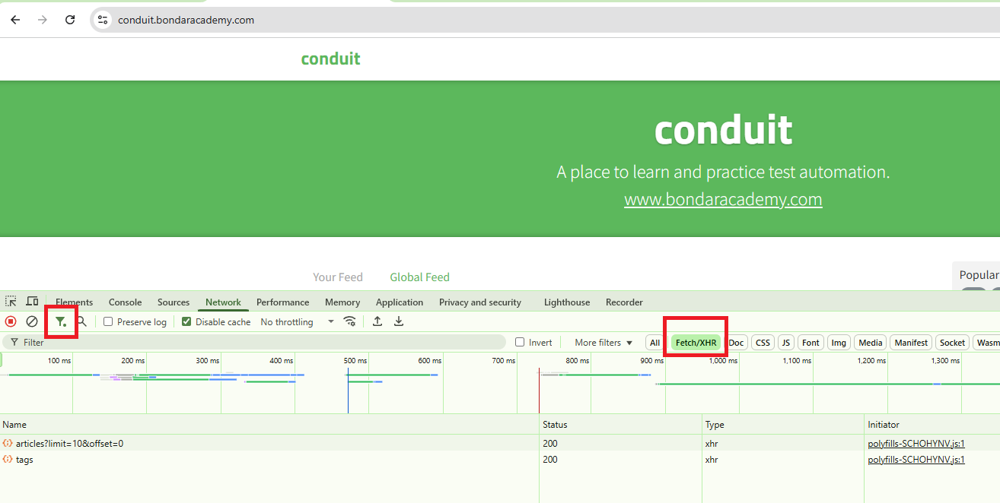

## ngx-cypress-test-master 
- https://enbridge.udemy.com/course/cypress-web-automation-testing-from-zero-to-hero
- https://github.com/bondar-artem/ngx-cypress-test/tree/UdemyClass

## install and run
- npm install --force
- npm start
- visit http://localhost:4200/pages
## install cypress
- npm install cypress --save-dev --force
- should find "cypress": "^14.5.3" in package.json

## npm vs npx
- npm: a way for developers to install Node.js packages both globally and locally
- npx: Run a locally Node.js based executable package, like npx cypress open
  - choose E2E => Electron => Great! We added the following files to your project
  - match test case
    

## multiple Config Files Example
```
cypress.config.angular.ts
cypress.config.react.ts
cypress.config.vue.ts
```
npx cypress run --config-file cypress.config.react.ts

## Config skipped 2 folders, so one file shows up only


## Understanding DOM and terminology Summary:
- Html DOM consists of: HTML Tags, HTML Attributes and Attribute values
- “Class” and “ID” are also HTML attribute names
- “Class” attribute can have several values and each value is separated by space
- HTML tags usually come in pairs of Opening and Closing tag. Closing tag has the same name and forward slash
- Value in between angle brackets (>here<) is a plain text
- Elements above the “key” web element are Parent Elements
- Elements inside of the “key” web element are Child Elements
- Elements placed at the same level side by side are Sibling Elements


## add followin reference line to test file
```
/// <reference types="cypress" />
// When you add /// <reference types="cypress" />, 
// your editor recognizes Cypress types and also Mocha types,
// since Cypress test syntax is built on top of Mocha and Chai.
```

## SelectorsHub tool for inspecting web element


## Suppose want to find a button labeled "Submit" 
- inside a form, check its parent form, 
- then find an input inside that form 
- and assert that it is visible.
```
cy.contains('button', 'Submit')        // Find the button with text "Submit"
  .parents('form')                     // Get its parent form
  .find('input[name="email"]')         // Find the email input inside the form
  .should('be.visible');               // Assert that the input is visible

//default is 4 seconds asynchronous waiting
cy.get('input[name="email"]', { timeout: 10000 }).should('be.visible'); // 10 seconds
```

## Cypress .then() is similar to JavaScript Promises. 
- it allows you to access the resolved value of a Cypress command and perform further actions
- just like chaining with Promises in Playwright.
```
/// <reference types="cypress" />

function usingThenGridForm(gridSelector, formSelector, username, password) {
  cy.get(gridSelector).then(grid => {
    // Interact with the grid, e.g., select the first row
    const firstRow = grid.find('tr').eq(0);
    cy.wrap(firstRow).click();

    cy.get(formSelector).then(form => {
      // Fill both username and password fields
      cy.wrap(form).find('input[name="username"]').type(username);
      cy.wrap(form).find('input[name="password"]').type(password);
      cy.wrap(form).find('button[type="submit"]').click();
    });
  });
}

describe('Grid and Form interaction with usingThenGridForm', () => {
  it('should fill username and password and submit the form', () => {
    cy.visit('/your-page-url');
    usingThenGridForm('.data-grid', '.edit-form', 'testuser', 'testpass');
  });
});
```

## extact text value
```
  it('should get email using .invoke("prop", "value")', () => {
    cy.visit('/your-page-url');
    cy.get('input[name="email"]')
      .type('test@test.com')
      .invoke('prop', 'value')
      .then(email => {
        expect(email).to.equal('test@test.com');
      });
  });
```

## different web elements code samples
'''
/// <reference types="cypress" />
describe('Demo of various web elements', () => {
  it('should interact with checkboxes, radios, date pickers, dropdowns, tables, popups, and assertions', () => {
    cy.visit('/your-page-url');

    // Checkboxes and Radio Buttons
    cy.get('input[type="checkbox"][name="subscribe"]').check().should('be.checked');
    cy.get('input[type="radio"][value="option1"]').check().should('be.checked');

    // Web Date Pickers (part 1)
    cy.get('input[type="date"]').type('2025-07-27').should('have.value', '2025-07-27');

    // Web Date Pickers (part 2)
    cy.get('.datepicker-toggle').click();
    cy.get('.datepicker-day[data-day="27"]').click();
    cy.get('input[type="date"]').should('have.value', '2025-07-27');

    // Lists and Dropdowns
    cy.get('select[name="country"]').select('Canada').should('have.value', 'Canada');
    cy.get('ul.list-items > li').contains('Item 3').click();

    // Web Tables (part 1)
    cy.get('table tbody tr').eq(0).find('td').eq(1).should('contain.text', 'John Doe');

    // Web Tables (part 2)
    cy.get('table tbody tr').eq(1).find('button.edit-row').click();

    // PopUps and ToolTips
    cy.on('window:alert', (str) => {
      expect(str).to.equal('This is an alert!');
    });
    cy.get('.tooltip-trigger').trigger('mouseover');
    cy.get('.tooltip-content').should('be.visible').and('contain', 'Tooltip text');

    // Cypress Assertions
    cy.get('.success-message').should('be.visible');
    cy.get('.error-message').should('contain.text', 'Invalid credentials');
    cy.get('button.submit').should('have.class', 'btn-primary');
  });
});
'''

## create cypress/support/ for refactoring command code class

## overide existing command of cy, for example cy.createUser
https://docs.cypress.io/api/cypress-api/custom-commands
```
Cypress.Commands.add('createUser', (user) => {
  cy.request({
    method: 'POST',
    url: 'https://www.example.com/tokens',
    body: {
      email: 'admin_username',
      password: 'admin_password',
    },
  }).then((resp) => {
    cy.request({
      method: 'POST',
      url: 'https://www.example.com/users',
      headers: { Authorization: 'Bearer ' + resp.body.token },
      body: user,
    })
  })
})

cy.createUser({
  id: 123,
  name: 'Jane Lane',
})
```

## API test
https://conduit.bondaracademy.com/




