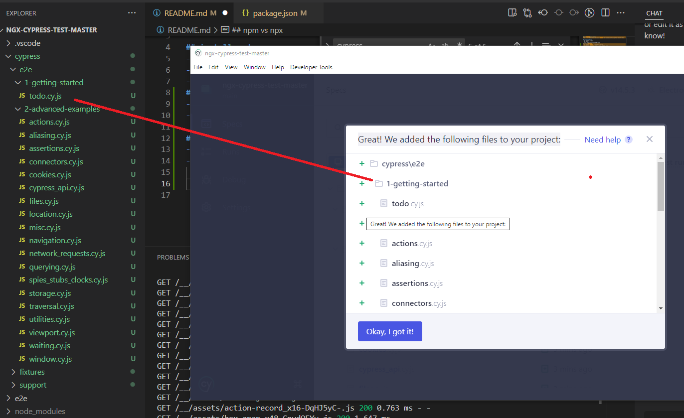
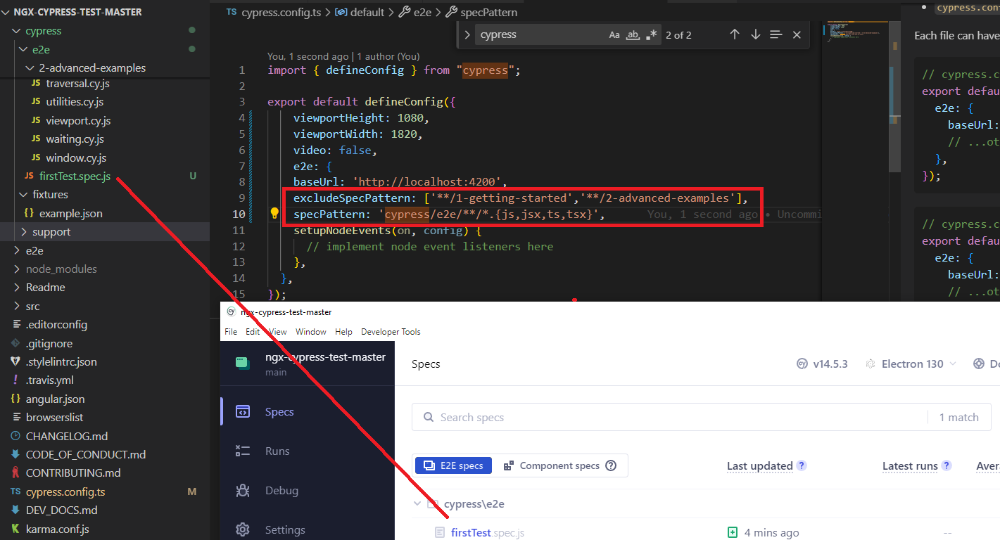
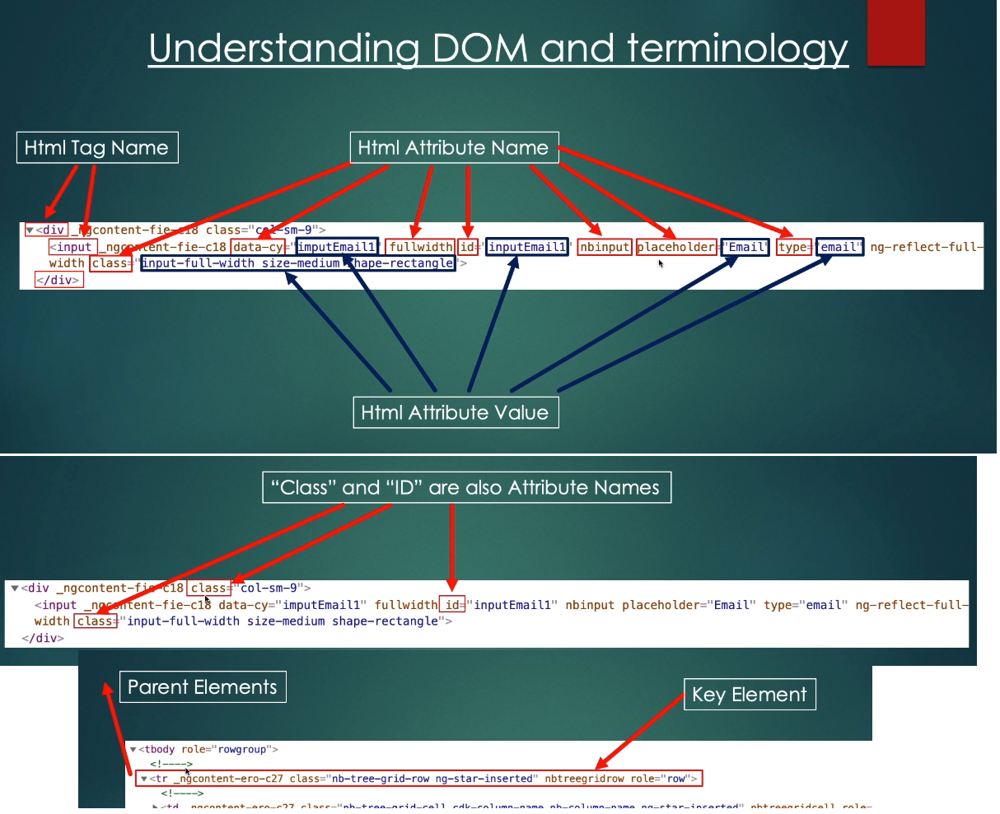
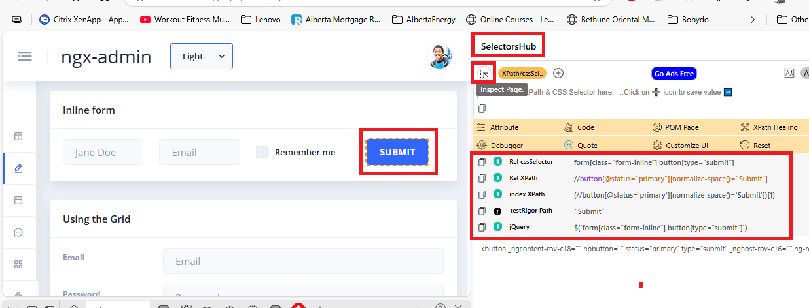

## ngx-cypress-test-master 
- https://enbridge.udemy.com/course/cypress-web-automation-testing-from-zero-to-hero
- https://github.com/bondar-artem/udemy-realworld-app

## install and run
- npm install --force
- npm start
- visit http://localhost:4200/pages
## install cypress
- npm install cypress --save-dev --force
- should find "cypress": "^14.5.3" in package.json

## npm vs npx
- npm: a way for developers to install Node.js packages both globally and locally
- npx: Run a locally Node.js based executable package, like npx cypress open
  - choose E2E => Electron => Great! We added the following files to your project
  - match test case
    

## multiple Config Files Example
```
cypress.config.angular.ts
cypress.config.react.ts
cypress.config.vue.ts
```
npx cypress run --config-file cypress.config.react.ts

## Config skipped 2 folders, so one file shows up only


## Understanding DOM and terminology Summary:
- Html DOM consists of: HTML Tags, HTML Attributes and Attribute values
- “Class” and “ID” are also HTML attribute names
- “Class” attribute can have several values and each value is separated by space
- HTML tags usually come in pairs of Opening and Closing tag. Closing tag has the same name and forward slash
- Value in between angle brackets (>here<) is a plain text
- Elements above the “key” web element are Parent Elements
- Elements inside of the “key” web element are Child Elements
- Elements placed at the same level side by side are Sibling Elements



## add followin reference line to test file
```
/// <reference types="cypress" />
// When you add /// <reference types="cypress" />, 
// your editor recognizes Cypress types and also Mocha types,
// since Cypress test syntax is built on top of Mocha and Chai.
```

## SelectorsHub tool for inspecting web element


## Suppose want to find a button labeled "Submit" 
- inside a form, check its parent form, 
- then find an input inside that form 
- and assert that it is visible.
```
cy.contains('button', 'Submit')        // Find the button with text "Submit"
  .parents('form')                     // Get its parent form
  .find('input[name="email"]')         // Find the email input inside the form
  .should('be.visible');               // Assert that the input is visible
```
